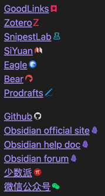

# Obsidian external links icon
A  simple plugin that auto adds icon to the external links. 

# Support links
## URL Scheme
- GoodLinks
- Zotero
- SnippetsLab
- SiYuan Note
- Eagle
- Bear
- Prodrafts

## WebSite
- Github
- Obsidian
- 少数派
- 微信公众号

# Performance
This plugin is designed for high performance. 

Every image has been meticulously optimized, with most displayed in `SVG` format. 

Some icons are adaptive to the _Base color scheme_ and will automatically adjust their highlight color accordingly.

# Installation
Use the [BRAT](https://obsidian.md/plugins?id=obsidian42-brat) to install this plugin.
