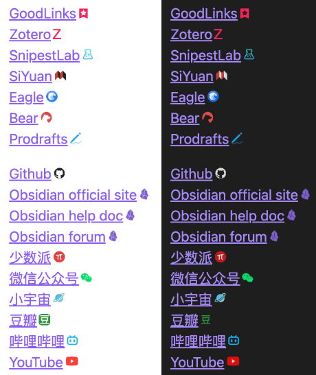
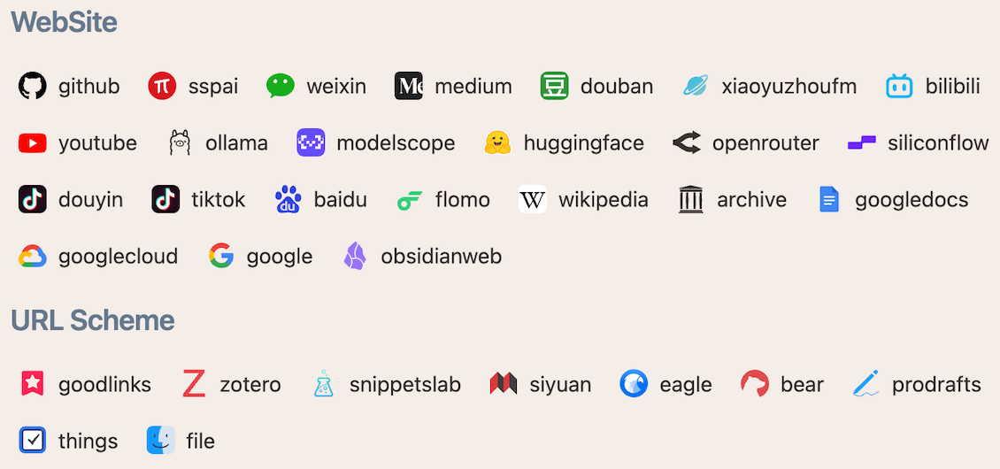
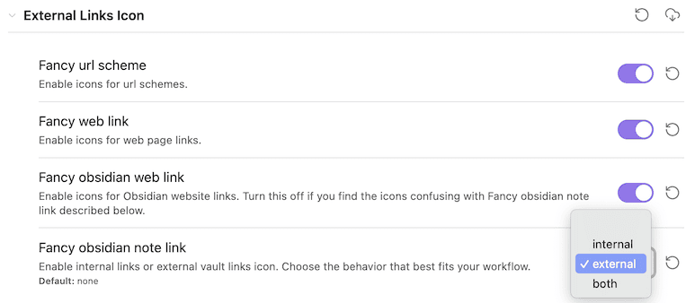

    <h1>External links icon</h1>
    

        
        
        
        
    

    
[ English | <a href="https://github.com/moziar/obsidian-external-links-icon/blob/master/README_zh.md">简体中文</a > ]

    
A simple plugin that automatically adds icons to the external and internal links, designed to work seamlessly in your local environment.

	
<strong>Built-in links</strong>

### URL Scheme
- GoodLinks
- Zotero
- SnippetsLab
- SiYuan Note
- Eagle
- Bear
- Prodrafts
- Things
- Apple Shortcuts
- Advanced-URI
- Craft

### WebSite
- Github
- 少数派 SSPai
- 微信公众号
- Medium
- 小宇宙 FM
- 豆瓣 Douban
- 哔哩哔哩 BiliBili
- YouTube
- Ollama
- ModelScope
- Hugging Face
- OpenRouter
- SiliconFlow
- 抖音/TikTok
- Baidu
- flomo
- Wikipedia
- Archive.org
- Google Docs
- Google Cloud
- Other Google site
- 知乎/zhihu
- 晚点/latepost

### Obsidian
- Website
  - official site
  - help doc
  - forum
- Note Link
  - internal link
  - external vault link

## Custom Icons
To add a custom icon, click **Add Website** or **Add URL Scheme** in the settings.

- Only **SVG** format is supported.
- The plugin will auto compress icon to improve performance.

## Performance
This plugin is designed for high performance.

Every built-in image has been meticulously optimized, with most displayed in `SVG` format.

Some icons are adaptive to the _Base color scheme_ and will automatically adjust their highlight color accordingly.

## Installation
### From Obsidian Community (Recommended)
Open the Community Plugins tab in the settings and search for "Iconify" (or click [here](https://obsidian.md/plugins?id=external-links-icon)).

### Manual Installation
Use the [BRAT](https://github.com/TfTHacker/obsidian42-brat) to install this plugin.

1. Install [BRAT](https://obsidian.md/plugins?id=obsidian42-brat) Obsidian plugin
2. Use `BRAT: Plugins: Add a beta plugin for testing` command to install a new plugin
3. Enter `moziar/obsidian-external-links-icon` on the popup window
4. Enjoy

## Setting
By default, both URL Scheme and WebSite icon are enabled. You could disable any of them via the **Style Setting plugin**.

There are two different Obsidian icons to help users better distinguish between Obsidian web links and note links.

Obsidian Note Link icon is disabled by default. You can enable either _internal link_, _external link_, or both, or disable them entirely — it all depends on your workflow.

## Credit
Inspire by [marginnote-companion](https://github.com/aidenlx/marginnote-companion).
