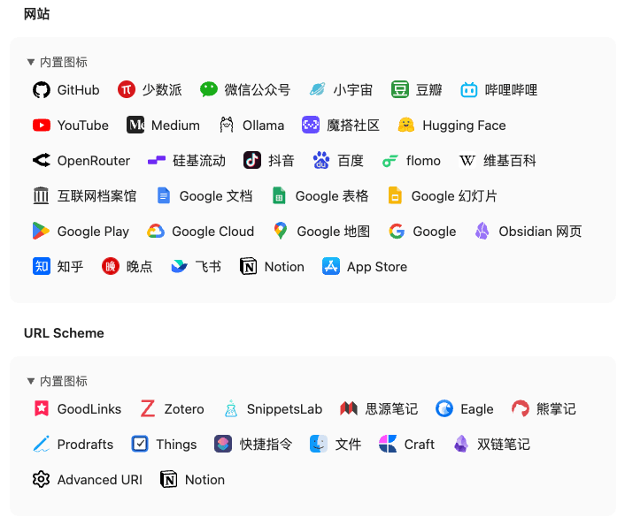
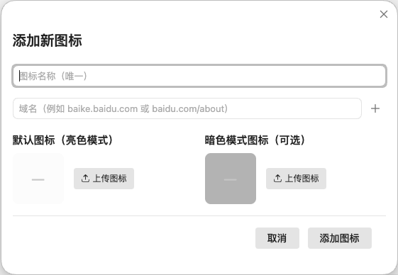
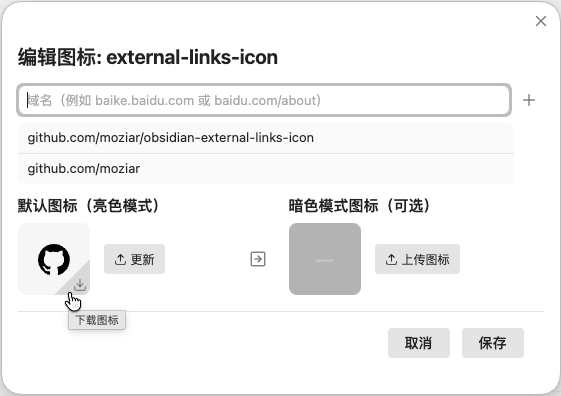
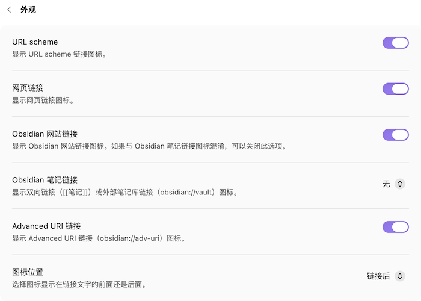

    <h1>External links icon</h1>
    

        
		
        
        
        
    

    
[ <a href="https://github.com/moziar/obsidian-external-links-icon/blob/master/README.md">English</a> | 简体中文 ]

    
一个简单的插件，自动为外部链接和内部链接添加图标，专为本地环境无缝使用而设计。

	
<strong>内置链接</strong>

### URL Scheme
- GoodLinks
- Zotero
- SnippetsLab
- 思源笔记
- Eagle
- 熊掌记
- Prodrafts
- Things
- Apple 快捷指令
- Advanced-URI
- Craft

### 网站
- Github
- 少数派
- 微信公众号
- Medium
- 小宇宙 FM
- 豆瓣
- 哔哩哔哩
- YouTube
- Ollama
- 魇搭社区
- Hugging Face
- OpenRouter
- 硅基流动
- 抖音
- 百度
- flomo
- 维基百科
- Archive.org
- Google Docs
- Google Cloud
- 其他 Google 站点
- 知乎
- 晚点

### Obsidian
- 网站
  - 官网
  - 帮助文档
  - 论坛
- 笔记链接
  - 双向链接
  - 其他笔记库链接

## 安装
### 从 Obsidian 社区安装（推荐）
在设置的社区插件标签页中搜索 " External Links Icon"（或点击[这里](https://obsidian.md/plugins?id=external-links-icon)）。

### 手动安装
使用 [BRAT](https://github.com/TfTHacker/obsidian42-brat) 安装本插件。

1. 安装 [BRAT](https://obsidian.md/plugins?id=obsidian42-brat) Obsidian 插件
2. 使用 `BRAT: Plugins: Add a beta plugin for testing` 命令安装新插件
3. 在弹窗中输入 `moziar/obsidian-external-links-icon`
4. 开始使用

## 使用
### 添加图标
在设置中点击 **添加网站** 或 **添加 URL Scheme** 即可添加自定义图标。

- 仅支持 **SVG** 格式。
- 插件会自动压缩图标以提升性能。
- 默认图标（亮色模式）是必选的，暗色模式图标是可选的。

### 编辑图标
- 你可以点击图标旁边的下载按钮来下载图标。
- 如果你误将暗色图标上传到亮色区域，`复制到暗色` 按钮将派上用场。
- 如果用不到暗色图标，你可以使用 `移除` 按钮删除它。

## 设置
- 默认情况下，URL Scheme 和网站图标均已启用。你可以在插件设置中禁用其中任意一项。
- 插件提供了两种不同的 Obsidian 图标，以帮助用户更好地区分 Obsidian 网站链接和笔记链接。
- Obsidian 笔记链接图标默认关闭。你可以启用 _双链_、_外链_，或两者都启用，也可以完全关闭 — 取决于你的工作流。
- 你可以自定义图标位置（在链接前面或者后面），以确保跟其他插件（例如 Iconize）保持一致。

## 致谢
灵感来自 [marginnote-companion](https://github.com/aidenlx/marginnote-companion)。
